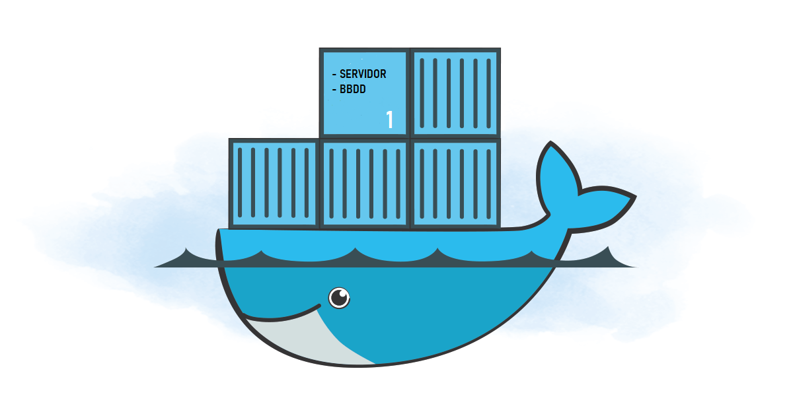
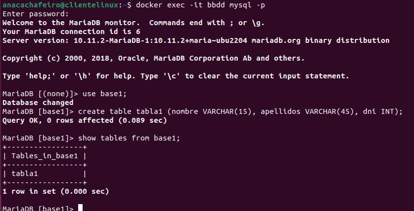

 
 
 
DAW - 2022/2023 * Ana Cachafeiro
 
 
 
 
 

 
 
 
 
 

## Actividad evaluable 3 - Docker - 2ª Evaluación
 
 
 
 
 

### Ejercicio 1 - Trabajo con imágenes

* Apartado 1.1 <b style = 'color : green;'>Servidor web</b>

* Apartado 1.2 <b style = 'color : green;'>Servidor de base de datos</b>

 
 
 
 
 
 
 
 
 
 
 

-----

 
 

# Ejercicio 1 - Trabajo con imágenes
 

## 1.1 Servidor web

#### <i>Iniciamos la actividad requerida, que sirva este archivo como documentación de la misma. </i>
* ##### Primeramente, una vez descargada la imagen de <b><i>Apache</i></b> de Docker Hub, arrancamos un contenedor para instanciar la imagen <b><i>php:7.4-apache</i></b> de nombre <b><i>servidor</i></b> y con puerto <b><i>1234</i></b>.

~~~ 
docker pull php:7.4-apache
~~~

~~~ 
docker run -d --name servidor -p 1234:80 php:7.4-apache
~~~

* ##### Verificamos que el contenedor se ha creado y funciona correctamente.
~~~ 
docker ps -a -s
~~~

#### Ahora, en el contenedor colocaremos un sitio web con sus correspondientes ficheros, carpeta de estilos, imágenes, etc. 
* ##### Creamos una carpeta para introducir en ella el template que hemos descargado de internet de manera gratuita y modificado en Visual Studio Code, que llamaremos <b><i>SitioWeb1</i></b>.

~~~ 
mkdir SitioWeb1
~~~

* ##### Directorio raíz del servicio web <b><i>/var/www/html </i></b>

~~~ 
docker cp SitioWeb1 servidor:/var/www/html/
~~~

* ##### Mostramos el fichero <b><i>index.html</i></b> en el navegador.

#### En ese mismo directorio raíz colocaremos un archivo llamado <b><i>cabeceras.php</i></b> que muestre todas las cabeceras de petición HTTP de la llamada actual. 

* ##### Creamos el archivo con gedit <b><i>cabeceras.php</i></b>.

~~~ 
gedit cabeceras.php
~~~

* ##### Realizamos la acción de mover el archivo al directorio raíz.

~~~ 
docker cp /home/anacachafeiro/cabeceras.php servidor:/var/www/html/
~~~

* ##### Mostramos la salida del script en el navegador .

* ##### Mostramos el tamaño del contenedor <b><i>servidor</i></b> antes y después de añadir el contenido anterior.

 
 
 

## 1.2 Servidor de base de datos

#### <i>Continuamos con la segunda parte de la actividad.</i>
* ##### Descargadamos la imagen de <b><i>mariadb</i></b> de Docker Hub.
~~~ 
docker pull mariadb
~~~

* ##### Mostramos.
~~~ 
docker ps -a
~~~

* ##### Pasamos a crear un contenedor que instancia la imagen <b><i>mariadb</i></b> con las variables del entorno necesarias.
~~~ 
docker run -d --name bbdd -e MYSQL_DATABASE=base1 -e MYSQL_ROOT_PASSWORD=root 
-e MYSQL_USER=daw -e MYSQL_PASSWORD=laboral1 mariadb
~~~

* ##### Nos conectamos con el usuario <b><i>root</i></b>.
~~~ 
docker exec -it bbdd mysql -p
~~~

* ##### Con el usuario root creamos una tabla <b><i>tabla1</i></b> en la base de datos <b><i>base1</i></b> con algunos datos y mostramos la tabla.
~~~ 
use base1;
create table tabla1 (nombre VARCHAR(15), apellidos VARCHAR(45), dni INT);
show tables from base1
~~~

* ##### Nos conectamos con el usuario <b><i>daw</i></b> y mostramos la base de datos<b><i> base1</i></b> y la <b><i>tabla1</i></b>.
~~~ 
docker exec -it bbdd mysql -u daw -p
~~~

~~~ 
show databases;
show tables from base1;
~~~

* ##### Comprobamos que no se puede borrar la imagen mariadb mientras el contendor bbdd está creado.
~~~ 
docker rmi mariadb
~~~ 

* ##### Instalamos la aplicación <b><i>dbeaver-ce</i></b> para conectarnos desde la máquina cliente a la base de datos.

 
 

#### Finalizamos el apartado 1, borrando los contenedores y mostrando que no hay ninguno en uso.

* ##### Borramos el contenedor <b><i>bbdd</i></b>.

~~~ 
docker rm -f bbdd
~~~

* ##### Borramos el contenedor <b><i>servidor</i></b>.

~~~ 
docker rm -f servidor
~~~

 
 

## Webgrafía
* ##### Páginas webs
#### Docker
https://iesgn.github.io/curso_docker_2021/sesion2/ejercicios.html
https://osl.ugr.es/2021/03/24/tutorial-basico-de-docker/

#### CABECERAS

https://www.php.net/manual/es/function.header.php
https://www.mclibre.org/consultar/php/lecciones/php-cabeceras.html
https://www.albertcoronado.com/2017/10/24/obtener-los-datos-de-la-cabecera-en-php/

#### DBEAVER-CE
https://nksistemas.com/como-instalar-dbeaver-ubuntu-22-04-lts-jammy-linux/

* ##### Apuntes segundo trimestre DAW
 
