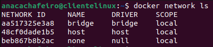

 
 
 
DAW - 2022/2023 * Ana Cachafeiro
 
 
 
 
 

 
 
 
 
 

## Actividad evaluable 3 - Docker - 2ª Evaluación
 
 
 
 
 

### Ejercicio 2 - Redes y almacenamiento

* Apartado 1- <b style = 'color : green;'>Despliegue de contenedores en red: Adminer y MariaDB</b>

 
 
 
 
 
 
 
 
 
 
 
 
 
 
 

-----

# Ejercicio 2 - Redes y almacenamiento
 

## 1.- Despliegue de contenedores en red: Adminer y MariaDB

#### <i>Para esta actividad vamos a trabajar con redes virtuales y almacenamiento. Pasamos a comentar la solución. </i>
* ##### Es importante recordar, que cada vez que creamos un contenedor, este se conecta a <b><i>red virtual</i></b> y Docker hace una configuración del sistema para que la máquina tenga una ip interna, teniendo así acceso al exterior y podamos mapear. Usa estas tres redes predefinidas: <b><i>red tipo bridge, </i></b><b><i>red tipo host, </i></b><b><i>red tipo none.</i></b>

* ##### Podemos ver las redes que tenemos cuando hemos instalado Docker. 
~~~ 
docker network ls
~~~

* ##### Comenzamos creando una <b><i>red bridge bdnet</i></b>

~~~ 
docker network create bdnet
docker network ls
~~~

* ##### Continuamos creando un contenedor con la imagen de <b><i>mariadb</i></b> que nos hemos descargado de Docker Hub y que estará en la <b><i>red bdnet</i></b> y con las siguientes especificaciones. Así como un volumen de datos persistente.

~~~ 
docker pull mariadb
~~~

~~~ 
docker volume create dataDB
docker network ls
~~~

~~~ 
docker run -d --network bdnet --name mibase -e MYSQL_ROOT_PASSWORD=root -v dataDB:/var/lib/mysql mariadb
~~~

* ##### El siguiente paso será crear un contenedor con el programa <b><i>Adminer</i></b> que se conecte al contenedor de la base de datos.

~~~ 
docker run -d --network bdnet --name miadminer -p 8080:8080 -e ADMINER_DEFAULT_SERVER=myDB adminer
~~~

* ##### Mostramos contenedores creados y funcionando.
~~~ 
docker ps -a
~~~

* ##### Vamos al navegador, introducimos la url: <b><i>http://localhost:8080</i></b>
~~~ 
http://localhost:8080
~~~

* ##### Introducimos el usuario (root) y la contraseña (root)

* ##### Una vez dentro de Adminer creamos una base de datos llamada <b><i>despliegue</i></b>. Aprovechamos para crear una tabla con datos varios. 

* ##### Ahora vamos a la ruta <b><i>/var/lib/docker/volumenes/dataDB/_data</i></b>. Comprobamos los datos generados por el contenedor del servidor de base de datos. Confirmamos la base de datos <b><i>despliegue</i></b> y la <b><i>tabla1</i></b>. 

* ##### Finalizamos la tarea borrando por este orden: los volúmenes, los contenedores y la red creada.
~~~ 
docker volume prune
~~~

~~~ 
docker rm -f miadminer
~~~
~~~ 
docker rm -f mibase
~~~

~~~ 
docker network rm bdnet
~~~

 
 
 
 
 
 
 

## Webgrafía

* ##### Adminer
https://kinsta.com/es/blog/adminer/

https://hub.docker.com/_/adminer/

* ##### Apuntes segundo trimestre DAW

 
