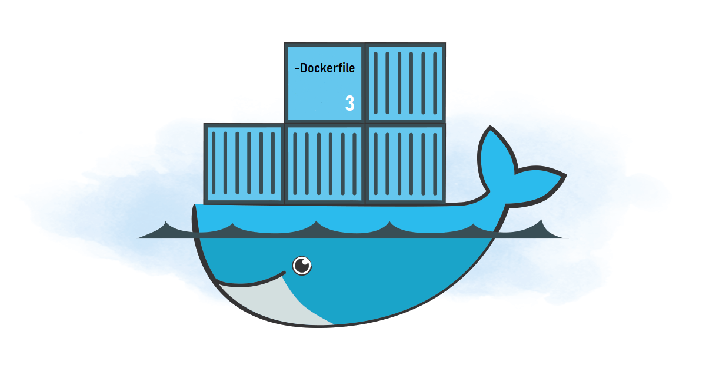
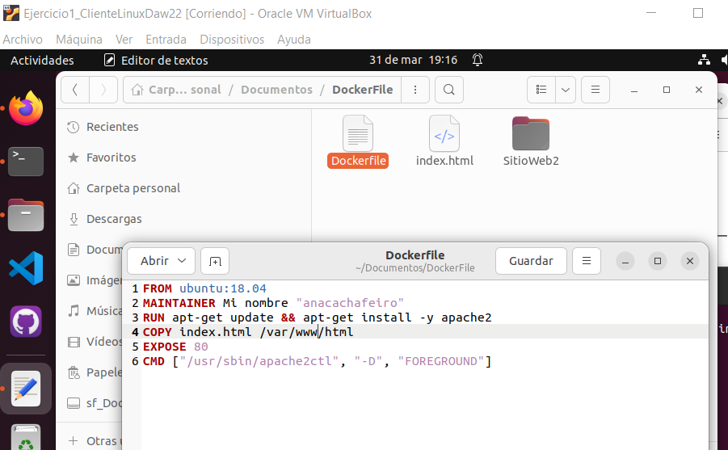
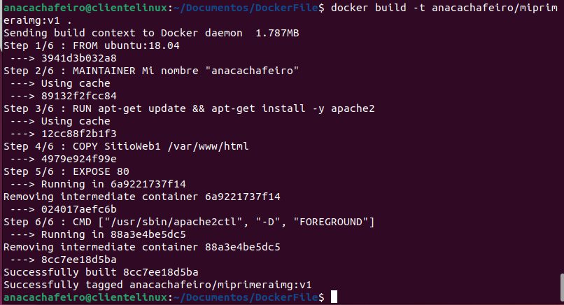
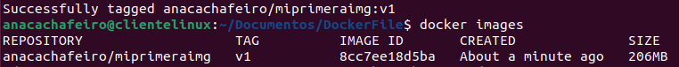
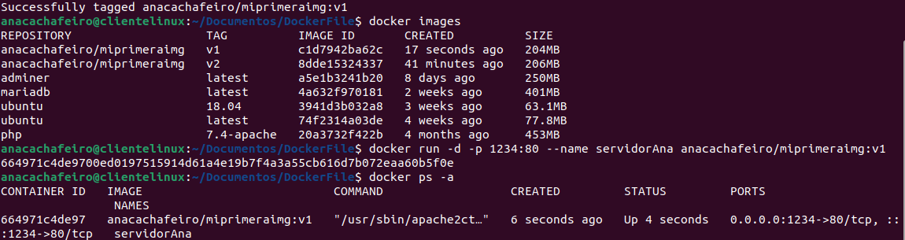
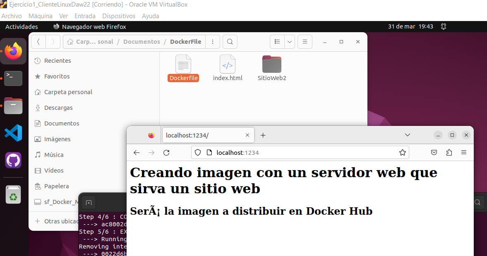
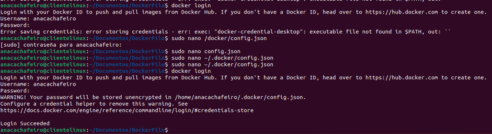
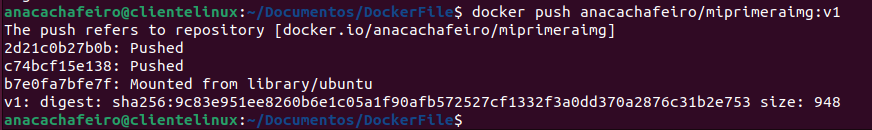
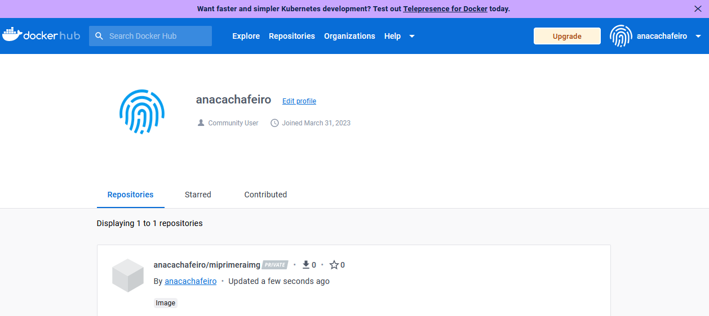

 
 
 
DAW - 2022/2023 * Ana Cachafeiro
 
 
 
 
 

 
 
 
 
 

## Actividad evaluable 3 - Docker - 2ª Evaluación
 
 
 
 
 

### Ejercicio 3 - Imagen con Dockerfile

* Apartado 1- <b style = 'color : green;'>Crear una imagen con un servidor web que sirva un sitio web</b>

 
 
 
 
 
 
 
 
 
 
 
 
 
 
 

-----

# Ejercicio 3 - Imagen con Dockerfile
 

## 1.- Crear una imagen con un servidor web que sirva un sitio web

#### <i>En esta actividad vamos a dockerizar una aplicación con una imagen personalizada. Hasta ahora las imágenes las traíamos de Docker Hub. En este caso serviremos nosotros nuestra propia imagen.</i>
* ##### El uso de ficheros <b><i>Dockerfile</i></b> y el comando <b><i>docker build</i></b> será nuestro método para crear imágenes de manera eficaz y fácilmente. En el fichero tenemos todas y cada una de las órdenes, capa a capa, necesarias para la construcción de la imagen.

* ##### Para comenzar creamos el Dockerfile sin extensión y nuestro sitio web. Mostramos la carpeta con los ficheros.

* ##### Seguidamente, creamos la nueva imagen propia. 
~~~ 
docker build -t anacachafeiro/miprimeraimg:v1 .
~~~

* ##### Comprobamos que se ha creado la imagen. 
~~~ 
docker images
~~~

* ##### Siguiente paso será crear un contenedor basado en dicha imagen, con la que accederemos al sitio web desde el navegador. 
~~~ 
docker run -d -p 1234:80 --name servidorAna anacachafeiro/miprimeraimg:v1
~~~

* ##### Sitio web en el navegador
~~~ 
localhost:1234
~~~

* ##### En el último punto del ejercicio, procedemos a subir la imagen a nuestra cuenta Docker Hub.

* ##### Se requiere autentificación de usuario y contraseña.
~~~ 
docker login
~~~

* ##### En una primera prueba de autentificación se produce error de contraseña. Después de buscar varias soluciones, la correcta fue modificar en el archivo <mark>~/.docker/config.json</mark> la palabra <mark>credsStore</mark> por <mark>credSore</mark>.
~~~ 
sudo nano ~/.docker/config.json
~~~

* ##### Subimos imagen al repositorio.
~~~ 
docker push anacachafeiro/miprimeraimg:v1
~~~

* ##### Nuestra propia imagen subida al repositorio de la aplicación web Docker Hub.

 
 
 
 
 
 
 

## Webgrafía

* ##### Dockerfile
https://forums.docker.com/t/docker-credential-desktop-exe-executable-file-not-found-in-path-using-wsl2/100225/4

https://cri.dev/posts/2020-07-06-How-to-solve-Docker-docker-credential-desktop-not-installed-or-not-available-in-PATH/

* ##### Apuntes segundo trimestre DAW

 
